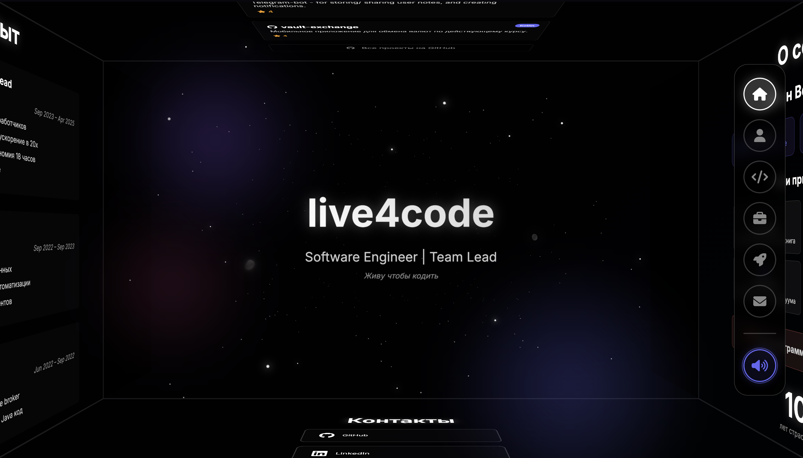

# Interactive Portfolio

[Check product](https://l1ve4code.github.io/live4code/)

An immersive 3D interactive portfolio showcasing software engineering expertise with a cosmic theme and modern web technologies.



## 🚀 Features

### Interactive 3D Experience
- **3D Rotating Cube**: Navigate through 6 faces representing different portfolio sections
- **Cosmic Background**: Animated starfield with nebulae, particles, and asteroids
- **Smooth Transitions**: Fluid animations between sections with CSS3 transforms
- **Audio Integration**: Background music and sound effects with visual audio analyzer

### Responsive Design
- **Desktop Version**: Full 3D cube navigation with mouse controls
- **Mobile Version**: Horizontal slider interface optimized for touch devices
- **Adaptive Layout**: Seamless experience across all screen sizes

### Portfolio Sections
1. **Home** - Welcome screen with typing animation
2. **About** - Professional background and expertise
3. **Skills** - Technical stack and competencies
4. **Experience** - Career timeline and achievements
5. **Projects** - GitHub integration with live project showcase
6. **Contact** - Professional contact information

### Technical Highlights
- **GitHub API Integration**: Automatic project fetching with caching
- **Audio Visualization**: Real-time audio analysis and visual effects
- **Performance Optimized**: Efficient rendering and resource management
- **SEO Ready**: Proper meta tags and favicon implementation

## 🛠️ Technologies Used

- **Frontend**: Vanilla JavaScript (ES6+), HTML5, CSS3
- **3D Graphics**: CSS3 Transforms, WebGL effects
- **Audio**: Web Audio API for visualization and playback
- **APIs**: GitHub REST API for project data
- **Design**: Responsive design with mobile-first approach

## 📁 Project Structure

```
live4code/
├── index.html          # Main HTML file (541 lines)
├── script.js           # Core JavaScript logic (1542 lines)
├── styles.css          # Styling and animations (2649 lines)
├── sounds/             # Audio assets
│   ├── background.mp3  # Background music
│   ├── click.mp3       # UI interaction sounds
│   └── ...
├── favicon/            # Favicon files
│   ├── favicon.ico
│   ├── favicon-16x16.png
│   ├── favicon-32x32.png
│   └── favicon-256x256.png
└── README.md
```

## 🎯 Core Classes

### JavaScript Architecture
- **`App`** - Main application controller
- **`CubeController`** - 3D cube navigation and rotation
- **`AudioManager`** - Sound effects and background music
- **`AudioVisualizer`** - Real-time audio analysis and visualization
- **`TypingAnimation`** - Typewriter effect for text display
- **`StarfieldManager`** - Cosmic background animations
- **`GitHubProjectsManager`** - GitHub API integration and project display
- **`MobileSlider`** - Touch-optimized mobile navigation
- **`VisibilityManager`** - Performance optimization for animations

## 🚀 Getting Started

### Prerequisites
- Modern web browser with JavaScript enabled
- Local web server (for GitHub API functionality)

### Installation

1. **Clone the repository**
   ```bash
   git clone https://github.com/l1ve4code/live4code.git
   cd live4code
   ```

2. **Serve locally**
   ```bash
   # Using Python
   python -m http.server 8000
   
   # Using Node.js
   npx serve .
   
   # Using PHP
   php -S localhost:8000
   ```

3. **Open in browser**
   ```
   http://localhost:8000
   ```

## 🎮 Navigation

### Desktop Controls
- **Mouse Click**: Click on visible cube faces to navigate
- **Navigation Buttons**: Use right-side navigation panel
- **Auto-rotation**: Cube rotates automatically when idle

### Mobile Controls
- **Swipe**: Horizontal swipe gestures to navigate between sections
- **Touch**: Tap navigation buttons for direct section access

## 🎨 Customization

### Modifying Content
- **Personal Info**: Update contact details in both mobile and desktop sections
- **Skills**: Modify skill categories and proficiency levels
- **Experience**: Update career timeline and achievements
- **Projects**: GitHub projects are fetched automatically from the configured username

### Styling
- **Colors**: Cosmic theme with customizable color variables in CSS
- **Animations**: Adjustable timing and easing functions
- **Layout**: Responsive breakpoints for different screen sizes

### Audio
- **Background Music**: Replace files in `/sounds/` directory
- **Sound Effects**: Customize interaction sounds
- **Visualization**: Modify audio analyzer parameters

## 🔧 Configuration

### GitHub Integration
Update the GitHub username in `script.js`:
```javascript
const GITHUB_USERNAME = 'your-username';
```

### Audio Settings
Modify audio preferences in the AudioManager class:
```javascript
this.backgroundVolume = 0.3; // Background music volume
this.effectsVolume = 0.5;    // Sound effects volume
```

## 📱 Browser Support

- **Chrome**: Full support (recommended)
- **Firefox**: Full support
- **Safari**: Full support
- **Edge**: Full support
- **Mobile Browsers**: Optimized touch interface

## 🎯 Performance Features

- **Lazy Loading**: Resources loaded on demand
- **Caching**: GitHub API responses cached locally
- **Optimization**: Efficient animation loops and memory management
- **Responsive Images**: Optimized assets for different screen sizes

## 👨‍💻 Author

**Ivan Vedenin (live4code)**
- GitHub: [@l1ve4code](https://github.com/l1ve4code)
- LinkedIn: [vedenin-ivan](https://linkedin.com/in/vedenin-ivan)
- Email: steven.marelly@gmail.com

*Built with ❤️ and lots of ☕ by live4code* 
